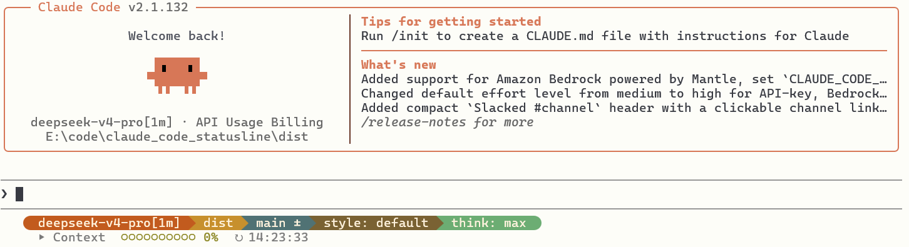

[English](README.md)
# Claude Code Powerline 状态栏

为 [Claude Code](https://claude.ai/code) 定制的 Powerline 风格状态栏。实时显示当前模型、工作目录、Git 分支与状态、输出模式、思考强度、上下文窗口用量和实时时钟 — 采用暖色复古终端配色。



## 布局

```text
┌─ 第一行 (Powerline) ──────────────────────────────────────────┐
│  Opus 4.7    .claude    master ✓    style: default    think: high  │
│  #C25B1E      #C7902D    #507274      #7A6233           #6CAD73    │
└────────────────────────────────────────────────────────────────┘
│  ▸ Context  ●●●○○○○○○○ 31%  ↻ 14:25:30                           │
└─ 第二行 (上下文进度条 + 时钟) ─────────────────────────────────────┘
```

**第一行段位：** Model → Directory → Git（非仓库目录自动隐藏）→ Output Style → Thinking

**第二行：** 10 格上下文进度条（●/○），颜色阈值 — 低于 60% 橄榄绿，60–84% 琥珀，85%+ 锈红。附带实时时钟。

**未安装 Nerd Font** 时自动降级为纯 ASCII：`[ Opus 4.7 ] [ .claude ] ...`

## 依赖

| 依赖 | 必需 | 安装方式 |
|-----------|----------|---------|
| **bash** | 是 | macOS/Linux 预装；Windows 需安装 [Git for Windows](https://git-scm.com/download/win) |
| **jq** | 是 | `brew install jq` / `apt install jq` / `winget install jqlang.jq` |
| **git** | 是 | 多数开发环境已预装 |
| **Nerd Font** | 推荐 | [nerdfonts.com](https://www.nerdfonts.com/) — JetBrainsMono、FiraCode 或 MesloLGS NF |

## 快速安装

### macOS / Linux

```bash
curl -fsSL https://raw.githubusercontent.com/RiverOfLogic/claude-code-statusline.git
```

或下载后手动运行：

```bash
git clone https://github.com/RiverOfLogic/claude-code-statusline.git
cd claude-code-statusline
bash install.sh
```

### Windows

在 **PowerShell** 中下载并运行：

```powershell
git clone https://github.com/RiverOfLogic/claude-code-statusline.git
cd claude-code-statusline
powershell -ExecutionPolicy Bypass -File .\install.ps1
```

> **注意：** Windows 下状态栏脚本在 Git Bash 中运行。请先安装 [Git for Windows](https://git-scm.com/download/win)。

## 安装器做了什么

1. 检查 `jq` 和 `git` 是否已安装
2. 复制 `statusline.sh` 到 `~/.claude/`
3. 设置可执行权限
4. 将 `statusLine` 配置写入 `~/.claude/settings.json`
5. 若未检测到 Nerd Font 则给出提示

## 手动配置

如果你更倾向于手动配置：

1. 将 `statusline.sh` 复制到 `~/.claude/` 并 `chmod +x`。
2. 在 `~/.claude/settings.json` 中添加：

```json
{
  "statusLine": {
    "type": "command",
    "command": "~/.claude/statusline.sh",
    "padding": 1,
    "refreshInterval": 5
  }
}
```

## 测试

```bash
echo '{
  "model": {"display_name": "Opus 4.7 (1M)"},
  "workspace": {"current_dir": "/home/me/project"},
  "context_window": {"used_percentage": 31},
  "output_style": {"name": "default"},
  "thinking": {"enabled": true},
  "effort": {"level": "high"}
}' | bash ~/.claude/statusline.sh
```

## 自定义

编辑 `~/.claude/statusline.sh` 可修改：

- **配色** — 修改 `BG_*` 和 `C_*` 变量（TrueColor `R;G;B` 值）
- **上下文阈值** — 调整 `-ge 85` / `-ge 60` 的分界值
- **段位顺序** — 重新排列 `build_powerline()` / `build_ascii()` 中的 `printf` 行
- **增加段位** — 解析额外的 JSON 字段并插入渲染链中

## 故障排除

| 问题 | 解决方案 |
|---------|----------|
| 状态栏不显示 | 确认脚本有执行权限（`chmod +x`），重启 Claude Code |
| 显示 `--` 或空值 | 首次 API 响应前为正常现象 — 发送消息后自动填充 |
| Powerline 字形显示为方框 | 安装 Nerd Font 并在终端中配置使用 |
| `jq: command not found` | 安装 jq（见上方依赖说明） |
| `git: command not found` | 安装 git（见上方依赖说明） |

## 文件

| 文件 | 用途 |
|------|---------|
| `statusline.sh` | 状态栏脚本（Bash + jq） |
| `install.sh` | macOS / Linux 安装器 |
| `install.ps1` | Windows PowerShell 安装器 |
| `README.md` | 英文说明 |
| `README_CN.md` | 中文说明（本文件） |

## 许可证

MIT
